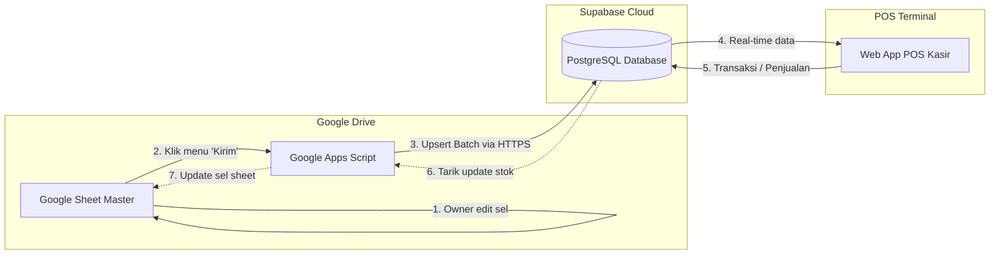

# Proposal & RFC: Mekanisme Sinkronisasi Google Sheets ⇄ Supabase
**Proyek:** DUA SISI POS  
**Tanggal:** 4 September 2026  
**Status:** Draf Diskusi / Bahan Rapat Internal  
**Target Pembaca:** Owner, Store Manager, & Tim Pengembang

---

## 1. Latar Belakang & Permasalahan

Sistem POS DUA SISI sebelumnya menggunakan Google Sheets sebagai basis data utama. Seiring peningkatan performa, kestabilan, dan skalabilitas toko, database utama telah berhasil ditingkatkan ke **Supabase PostgreSQL**. 

Hasilnya:
* Transaksi kasir menjadi sangat instan, stabil, dan minim risiko *timeout*.
* Pengelolaan status pesanan (*pipeline drop-off*) dan shift kasir berjalan *real-time*.

### Tantangan Habit Pengguna (*User Habit*)
Meskipun aplikasi POS berjalan lebih cepat, terdapat kebiasaan kerja (*habit*) harian yang sangat penting bagi Owner dan Manajer di Google Sheets:
1. **Fleksibilitas Edit Cepat:** Mengubah harga 20–50 layanan sekaligus, mengubah nama item, atau memperbarui modal layanan.
2. **Stok Opname Masal:** Memperbarui stok fisik dari nota faktur supplier dengan fitur *copy-paste* atau rumus spreadsheet.
3. **Kenyamanan Input:** Lebih leluasa mengetik di spreadsheet dibanding membuka formulir edit satu per satu di layar POS.

Saat ini, editan manual langsung pada sel Google Sheets **tidak otomatis tercermin ke Supabase**, sehingga diperlukan solusi jembatan agar kebiasaan praktis ini tetap bisa berjalan tanpa mengorbankan performa sistem POS.

---

## 2. Analisis Pilihan Solusi

| Kriteria | Opsi A: Menu Tombol Manual di Sheet | Opsi B: Auto-Sync Real-time (`onEdit`) | Opsi C: Hybrid (Menu + Timer Pengaman) 🏆 | Opsi D: Supabase Table Editor |
| :--- | :---: | :---: | :---: | :---: |
| **Deskripsi** | Menambah tombol menu di Google Sheet untuk kirim/tarik data. | Setiap ketikan di sel Sheet langsung memicu kirim ke Supabase. | Tombol manual untuk *commit* editan + sinkronisasi otomatis berkala (misal per 1 jam). | User login ke dashboard web Supabase (tampilan mirip spreadsheet). |
| **Kenyamanan User** | ⭐⭐⭐⭐ (Tinggal 1x klik setelah selesai edit) | ⭐⭐⭐ (Rentan lambat/lag saat mengetik) | ⭐⭐⭐⭐⭐ (Fleksibel & ada jaring pengaman) | ⭐⭐ (Perlu akun terpisah & antarmuka teknis) |
| **Keamanan Data** | ⭐⭐⭐⭐⭐ (User kirim saat data sudah fix/selesai) | ⭐⭐ (Data setengah ketik keburu terkirim) | ⭐⭐⭐⭐⭐ (Sangat aman & tervalidasi) | ⭐⭐⭐⭐ (Langsung ke SQL) |
| **Beban & Kuota Google** | Sangat Ringan (1 request per batch) | Sangat Berat (Rentan habis kuota harian API) | Sangat Ringan & Terukur | Nol beban Google |
| **Rekomendasi** | Sangat Baik | ❌ Kurang Disarankan | **REKOMENDASI UTAMA (BEST CASE)** | Alternatif Cadangan |

---

## 3. Rekomendasi Solusi: Pendekatan Hybrid (Best Case)

### 3.1. Konsep "Draft" dan "Publish"
Saat mengedit spreadsheet, pengguna sering kali menghapus baris, mencoba rumus, atau mengetik angka sementara. Pendekatan **Hybrid** memisahkan antara proses corat-coret (*drafting*) dan publikasi (*publishing*):
* **Fase Edit:** Owner bebas mengubah sel di sheet Layanan, Inventory, dll. POS kasir tidak terganggu data setengah jadi.
* **Fase Publish:** Setelah selesai dan yakin, Owner mengklik tombol menu **`Kirim ke Supabase`**.
* **Safety Net (Pengaman):** Jika Owner lupa mengklik tombol, sistem memiliki trigger timer otomatis (misal setiap 1 jam atau tiap pergantian hari) yang melakukan sinkronisasi cadangan.

### 3.2. Desain Tampilan Antarmuka di Google Sheet
Di bagian atas Google Sheet akan ditambahkan menu baru khusus:
```text
┌────────────────────────────────────────────────────────────────────────┐
│ File   Edit   View   Insert   Format   Data   Tools   ⚡ DUA SISI POS   │
└────────────────────────────────────────────────────────────────────────┴───┐
                                              │ 📤 Kirim ke Supabase (Push) │
                                              │ 📥 Tarik dari Supabase (Pull)│
                                              │ ───────────                 │
                                              │ ℹ️ Status Sinkronisasi      │
                                              └─────────────────────────────┘
```

1. **`📤 Kirim ke Supabase (Push)`**
   * Mengirim data master yang baru diedit di Sheet ke database Supabase.
   * Muncul pesan konfirmasi:  
     *"✅ Berhasil sinkronisasi 32 Layanan & 18 Item Inventory ke Supabase!"*
2. **`📥 Tarik dari Supabase (Pull)`**
   * Memperbarui Google Sheet dengan angka stok terbaru yang telah terpakai oleh penjualan kasir hari ini.
3. **`ℹ️ Status Sinkronisasi`**
   * Menampilkan kapan terakhir kali sinkronisasi berhasil dilakukan.

---

## 4. Klasifikasi & Batasan Data (Data Governance)

Untuk menjaga integritas database dan laporan keuangan, data dibagi menjadi dua kategori:

### A. Data yang BEBAS & AMAN Diedit di Google Sheet
* **Master Layanan & Harga:** Nama paket, harga satuan, kategori, icon, resep bahan baku (BOM).
* **Master Inventory:** Nama barang, stok opname fisik, stok minimum, harga jual/beli, status dijual/tidak.
* **Master Pelanggan:** Nama, nomor WhatsApp, catatan khusus, status member.
* **Master Pegawai & Akses:** Nama karyawan, nomor HP, peran (Kasir/Produksi/Manager).
* **Master Promo & Voucher:** Kode diskon, kuota pemakaian, tanggal kedaluwarsa.

### B. Data yang TIDAK BOLEH Diedit Sembarangan di Sheet (Hanya-Baca / Read-Only)
* **Transaksi Kasir & Pembayaran:**  
  *Alasan:* Transaksi di Supabase terikat dengan mutasi kas shift, pemotongan stok otomatis, sistem void dengan approval, dan webhook pesan nota digital WhatsApp.
* **Kas Shift & Mutasi Laci Kas:**  
  *Alasan:* Saldo awal dan akhir shift terikat dengan jam kerja kasir dan validasi fisik uang tunai.
* **Log Aktivitas & Audit:**  
  *Alasan:* Merupakan catatan keamanan historis yang tidak boleh dimodifikasi manual.

---

## 5. Arsitektur Teknis Singkat



* **Keamanan:** Komunikasi antara Google Apps Script dan Supabase menggunakan API Key terenkripsi (HTTPS).
* **Idempotensi:** Menggunakan mekanisme `upsert` berdasarkan `ID / Kode Unik`, sehingga tidak akan terjadi duplikasi data saat sync ditekan berulang kali.

---

## 6. Poin-Poin Bahan Diskusi untuk Rapat Internal

Pertanyaan kunci yang perlu disepakati bersama user/owner saat rapat:
1. **Frekuensi Penggunaan:** Seberapa sering owner biasanya mengubah data di Google Sheet? (Apakah harian, mingguan, atau hanya saat ada perubahan menu/promo baru?).
2. **Kebutuhan Stok Opname:** Apakah stok opname fisik biasanya diinput di Google Sheet setiap malam atau tiap akhir bulan?
3. **Penetapan Penanggung Jawab:** Siapa saja staf yang memiliki akses edit ke Google Sheet agar format tabel tidak rusak secara tidak sengaja?
4. **Validasi Tambahan:** Apakah diperlukan baris "Status" di Google Sheet untuk menandai baris mana yang berhasil / gagal disinkronkan?

---

*Dokumen ini disiapkan untuk mendukung kelancaran operasional dan memastikan kenyamanan pengguna tetap terjaga selama transformasi digital DUA SISI POS.*
