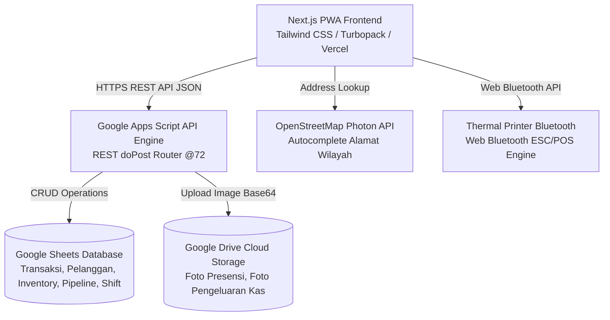

# 🧺 DUA SISI LAUNDRY — Cloud POS & Production Pipeline System

Sistem Point of Sale (POS) dan Manajemen Operasional Laundry berbasis Web/PWA Modern yang terintegrasi langsung dengan Google Apps Script (Serverless Database & Cloud Storage). Dirancang khusus untuk operasional **Express & Self Service Coin Laundry** dengan antarmuka responsif ramah tablet, pelacakan pipa produksi fisik drop-off, kontrol kasir shift, presensi selfie GPS, manajemen persediaan bahan baku (BOM), dan portal publik mandiri pelanggan.

---

## 🌟 Fitur Utama Sistem

### 1. 🛒 Point of Sale (POS Kasir Pintar)
- **Katalog & Keranjang Cepat**: Pencarian instan, filter kategori (Drop Off, Self Service Koin, Add On, FnB / Retail), dan navigasi layar sentuh.
- **Segmentasi & CRM Member**:
  - Auto-check nomor WhatsApp pelanggan saat input.
  - Pendaftaran member cepat dengan **Autocomplete Alamat OpenStreetMap (Photon API)**.
  - Sistem poin loyalitas eksklusif member (otomatis terproteksi & tersembunyi bagi pelanggan non-member).
  - Riwayat total order & status pelanggan (Member / Pelanggan Lama / Baru).
- **Rekomendasi Upselling & Cross-selling Otomatis**: Saran opsi kecepatan drop-off (Reguler / Express / Kilat), add-on pewangi premium, atau snack fnb.
- **Kalkulator Kasir & Split Payment**: Pembayaran Tunai dengan numpad layar sentuh, QRIS Dinamis/Statis, Transfer Bank, dan Debit/Kredit.
- **Pencetakan Struk Thermal Bluetooth (ESC/POS)**: Cetak struk kasir & label tag baju via Bluetooth Thermal Printer 58mm/80mm.
- **Kirim Struk WhatsApp & E-Nota Digital**: Kirim rincian nota bersih tanpa karakter rusak ke WhatsApp pelanggan dengan link E-Nota permanen.

### 2. 📋 Manajemen Pesanan Drop-off (Live Pipeline)
- **Papan Kanban Dinamis**: Kolom alur langkah pengerjaan (Dicuci, Dikeringkan, Disetrika, Dilipat, Siap Diambil) menyesuaikan secara dinamis dengan pipeline produk pesanan.
- **Pengalokasian Mesin Operasional**: Penugasan mesin washer/dryer fisik saat proses pengerjaan berjalan, beserta tracking nomor nota aktif.
- **Otomatisasi Pemotongan Bahan Baku (BOM)**: Stok deterjen, softener, plastik packing, dll otomatis terpotong dari gudang sesuai tahapan produksi yang sedang dikerjakan.

### 3. 🧼 Status Operational Mesin Cuci & Dryer
- Monitoring status mesin secara real-time (*Kosong*, *Digunakan*, *Maintenance*).
- Riwayat nomor nota drop-off yang sedang berputar di mesin beserta estimasi selesai.
- Shortcut mulai dan selesaikan mesin bagi staff kasir maupun manager.

### 4. 💵 Kas Shift & Serah Terima Kasir
- Pembukaan kas modal awal per shift.
- Pencatatan pengeluaran operasional outlet (bukti struk/bon difoto langsung dan tersimpan di Google Drive).
- Serah terima kasir (Handover Check) & perhitungan selisih kas fisik vs sistem saat tutup shift.

### 5. 👥 Presensi Selfie GPS & Jadwal Kerja Pegawai
- Presensi Clock-In / Clock-Out dengan verifikasi koordinat radius GPS outlet & foto selfie kamera langsung.
- Pengajuan dan persetujuan cuti/izin staff.
- Rekap kehadiran, denda keterlambatan otomatis, dan modul penggajian (Payroll) bulanan.

### 6. 🌐 Portal Publik Mandiri Pelanggan (Customer Landing Page)
- **3D DriftWall Gallery**: Galeri suasana outlet interaktif bebas foto AI.
- **Lacak Pesanan Drop-Off 2FA**: Pelanggan dapat melacak status pengerjaan cucian secara horizontal (menyamping) hanya dengan No. Nota + 4 digit nomor HP terdaftar.
- **Cek Saldo Poin & E-Nota Digital**: Cek saldo cashback poin member dan download PDF bukti pembayaran resmi kapan saja.

---

## 🏗️ Arsitektur Teknologi



### Tech Stack:
- **Frontend**: Next.js 16 (Turbopack, App Router), React 19, TypeScript, Lucide Icons, Canvas Confetti.
- **Styling**: Tailwind CSS, Modern Minimalist Design Tokens (Palette Slate & Deep Teal `#1E4648`).
- **Backend & Database**: Google Apps Script (V8 Engine) + Google Sheets Database + Google Drive API.
- **Integrasi Peta**: OpenStreetMap Nominatim/Photon Geocoding API.
- **Hardware Integration**: Web Bluetooth API ESC/POS Thermal Printing.

---

## 🚀 Panduan Memulai Cepat (Local Development)

### 1. Prasyarat
- Node.js versi 18 ke atas
- Akun Google dengan akses spreadsheet POS Dua Sisi Laundry
- Google Clasp CLI (`npm i -g @google/clasp`) untuk deploy backend

### 2. Instalasi & Menjalankan Frontend
```bash
# Clone repository
git clone https://github.com/roqueforti/duasisi-pos.git
cd duasisi-pos/next-app

# Install dependensi
npm install

# Jalankan server development
npm run dev
```
Buka browser di `http://localhost:3000/duasisi-terminal-pos` untuk masuk ke terminal POS.

### 3. Deploy Backend Google Apps Script
```bash
# Di direktori root duasisi-pos
npx clasp push
npx clasp deploy -i <DEPLOYMENT_ID> -d "Deployment description"
```

---

## 📂 Struktur Repositori

```
duasisi-pos/
├── Config.js                # Whitelist API, router doPost, dan helper sistem GAS
├── API_Transaksi.js         # Endpoint transaksi POS, perhitungan subtotal & diskon
├── API_Pelanggan.js         # Endpoint CRM pelanggan, saldo poin, dan pendaftaran member
├── API_Pipeline.js          # Endpoint tracking pipa produksi drop-off & token E-Nota
├── API_Shift.js             # Endpoint buka/tutup kas shift, pengeluaran & upload foto Drive
├── API_Layanan.js           # Endpoint master layanan, multi-bahan baku & kategori
├── API_System.js            # Endpoint audit log, verifikasi PIN, dan migrasi sheet
├── PRD.md                   # Product Requirements Document
├── SRS.md                   # Software Requirements Specification
├── SETUP_CHECKLIST.md       # Panduan konfigurasi production
└── next-app/                # Source code Next.js 16 Frontend App Router
    ├── app/                 # Next.js Pages & API Route handlers
    ├── components/          # Reusable UI views (PosView, PesananView, DriftWall, dll)
    ├── lib/                 # Types, API client, cache layer, bluetooth printer
    └── public/              # Aset statis & galeri foto outlet resmi
```

---

## 📄 Lisensi & Hak Cipta
Hak Cipta © 2026 Dua Sisi Laundry. Seluruh hak cipta dilindungi undang-undang.
